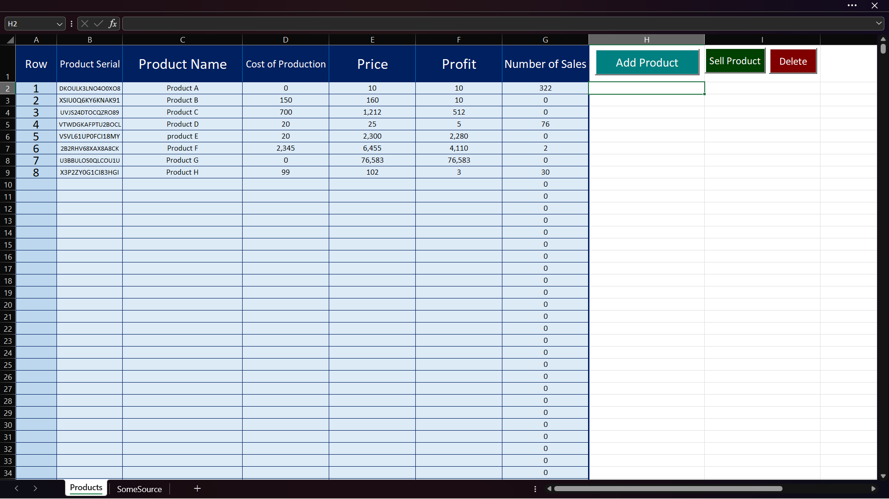
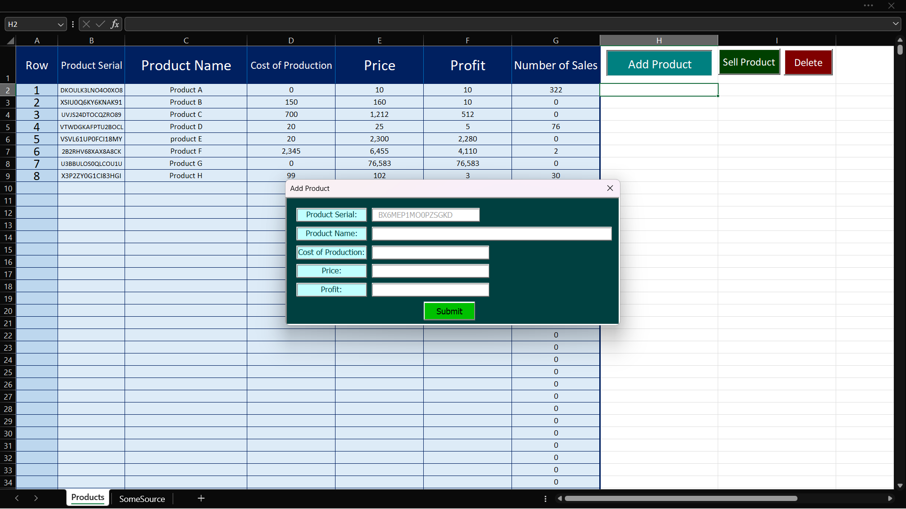
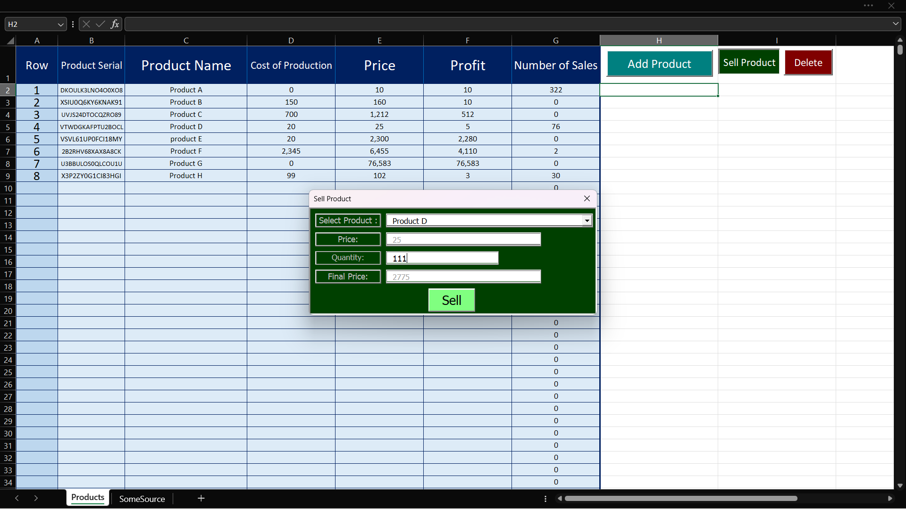
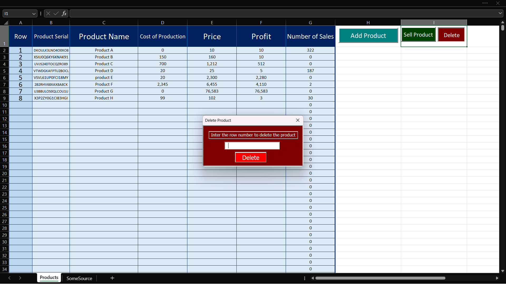
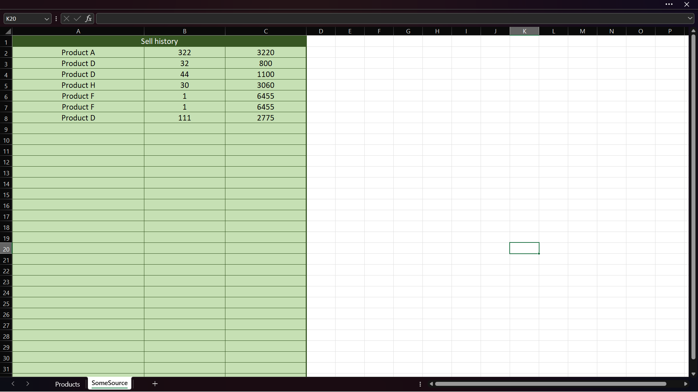

This excel project is just a basic example to demonstrateth how excel-based applications work. For more practical projects, feel free to contact me.

## Features
- Add products and generate unique serial for them or delete them.
- Sell products and and manage product sales

## Some images of application environment
| Products Page | Add UserForm | Sell UserForm | Delete UserForm | Sell History |
|:---:|:---:|:---:|:---:|:---:|
|  |  |  |  |  |

## Password for sheets and codes
If you wanna access vba codes or style sheet to practice or you are a developer and want to check the codes you can use this password : 1234

## ⬇️Try it now!
[⬇️ Download File](https://github.com/MPRogrammer1212/Simple-Product-Manager/releases/download/v1-0-0/SimpleAccounting.xlsm)

